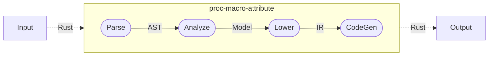

# tracing-attributes-http

Macro attributes for [`tracing`] HTTP spans and events.
This Crate source can serve as a template when you want to customize
`TracableError` handling.  See

## Features

Support for recording and exporting telemetry asynchronously can be added via the following flags:

    - `rt-tokio`: Spawn telemetry tasks using tokio’s multi-thread runtime.
    - `rt-tokio-current-thread`: Spawn telemetry tasks on a separate runtime so that the main runtime won’t be blocked.
    - `rt-async-std`: Spawn telemetry tasks using async-std’s runtime.

## Examples

All examples use the Jaeger UI for viewing distributed span and trace data.
To setup a Jaeger instance locally

```bash
podman run -p6831:6831/udp -p6832:6832/udp -p16686:16686 jaegertracing/all-in-one:latest
```

The traced data can be browsed at [`http://localhost:16686`](http://localhost:16686).

### Echo

The upstream `echo` example setup to be traceable, using the [`tracing`]() crate.

```bash
cargo run --features="full traceable tracing/max_level_trace" --example echo_trace
```

In a second console/shell:

```bash
curl localhost:3000/echo -XPOST -d 'hello world'
curl localhost:3000/echo/uppercase -XPOST -d 'hello world'
curl localhost:3000/echo/reverse -XPOST -d 'hello world'
firefox http://localhost:16686
```

## Developers

This Crate adopts the [Ferrous Systems](https://ferrous-systems.com/blog/testing-proc-macros/)
proc-macro pipeline:



[](https://mermaid.live/edit#pako:eNpNkN9qwyAUxl9FvEqh9gEyKIRujELCSro7zYXT00aIGsyR0pW--04rhXn1-fs-zx9v3EQLvOanKV7MqBOytn9TgdFZ8s856XlknZxTNMJrk-JQPMasS2DQxUAPXoyxQyUPOi0wrIRojt9CbJtKNkFP198n66jbRLStZBsvkB5s3xPYVXJH3ieEYVXKQbBF7MOcUWxYnxdkG7Ht_umvjGQ-B-Zr7iF57Sytc3sQxXEED4rXJC2cdJ5QcRXuFM2z1Qgf1mFMvMaUYc11xni8BvO6l8y70_QNvsD7H5EWYQA)

### Tests

To run an individual attribute test, say `server_send`:

```bash
cargo test server_send -- --nocapture
```

## `TraceableError`

Fork the [Hyper](https://github.com/hyperium/hyper) source code, then clone,
and add one of the following patch sections to the Hyper `Cargo.toml` -
depending on the stage of development:

```toml
# local/development version
[patch.crates-io]
tracing-attribute-http = { path = '../yours' }
```

```toml
# remote/deployed version
[patch.crates-io]
tracing-attribute-http = { git = 'https://github.com/you/yours' }
```

Next add a patch to the project Cargo.toml that uses Hyper - to ensure the
Hyper you build on uses your error handling:

```toml
# local/development version
[dependencies]
hyper = { version = "0.14", features = ["full"] }

[patch.crates-io]
hyper = { path = '../hyper' }
```

```toml
# remote/deployed version
[patch.crates-io]
hyper = { git = 'https://github.com/you/hyper' }
```

## License

Licensed under either of

- Apache License, Version 2.0 ([LICENSE-APACHE](http://www.apache.org/licenses/LICENSE-2.0)) or

- MIT license ([LICENSE-MIT](http://opensource.org/licenses/MIT))

at your option.

### Contribution

Unless you explicitly state otherwise, any contribution intentionally submitted
for inclusion in the work by you, as defined in the Apache-2.0 license, shall be
licensed as above, without any additional terms or conditions.
